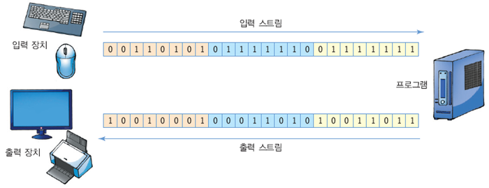
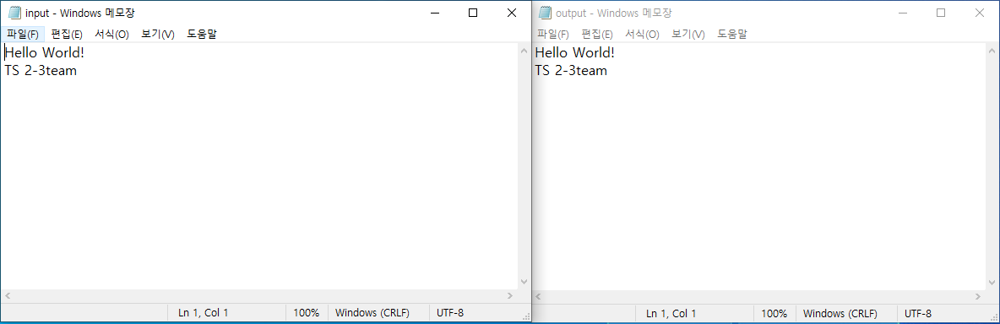

JAVA STUDY
Generics, Enum, Annotation
==================

# 스트림이란?
* 데이터를 운반하는데 사용되는 연결통로
* 연속적인 데이터의 흐름
* 단방향성, FIFO

# 바이트 단위 입출력 스트림

* InputStream / OutputStream
* 바이트 단위로 데이터 전송
* **File**InputStream, **File**OutputStream
* **ByteArray**InputStream, **ByteArray**OutputStream

# 문자 단위 입출력 스트림

* Reader / Writer
* 문자 단위로 데이터 전송
* **File**Reader, **File**Writer
* **Buffered**Reader, **Buffered** Writer

# 자바 입출력 상속 관계도

# 바이트 단위 입출력 예제(1)

<pre>
<code>
package exIO;

import java.io.*;

public class Ex1 {

	public static void main(String[] args) {
		// TODO Auto-generated method stub
		FileInputStream fis = null; 
        FileOutputStream fos = null;        
        try {
            fis = new FileInputStream("input.txt"); // 파일로부터 읽어오기 위한 객체
            fos = new FileOutputStream("output.txt"); // 파일에 쓸 수 있게 해주는 객체

            int readData = -1; // read() 메소드가 끝을 나타낼 때 -1을 return하므로 int형으로 선언
            while((readData = fis.read())!= -1){ // 1 byte씩 읽고
                fos.write(readData); // 1 byte씩 쓴다
            }           
        } catch (Exception e) {
            // TODO Auto-generated catch block
            e.printStackTrace();
        }finally{
            try {
                fos.close(); // OutputStream 닫기
            } catch (IOException e) {
                // TODO Auto-generated catch block
                e.printStackTrace();
            }
            try {
                fis.close(); // InputStream 닫기
            } catch (IOException e) {
                // TODO Auto-generated catch block
                e.printStackTrace();
            }
        }
	}

}

</code>
</pre>

# 바이트 단위 입출력 예제(2)

<pre>
<code>
package exIO;

import java.io.*;

public class Ex1 {

	public static void main(String[] args) {
		
		long startTime = System.currentTimeMillis();        
        FileInputStream fis = null; 
        FileOutputStream fos = null;        
        try {
            fis = new FileInputStream("input.txt");
            fos = new FileOutputStream("output.txt");

            int readCount = -1; 
            byte[] buffer = new byte[512]; //512 byte 크기의 바이트형 배열 생성
            while((readCount = fis.read(buffer))!= -1){
                fos.write(buffer,0,readCount);
            }
            
        } catch (Exception e) {
            // TODO Auto-generated catch block
            e.printStackTrace();
        }finally{
            try {
                fos.close();
            } catch (IOException e) {
                // TODO Auto-generated catch block
                e.printStackTrace();
            }
            try {
                fis.close();
            } catch (IOException e) {
                // TODO Auto-generated catch block
                e.printStackTrace();
            }
        }
    //메소드가 끝났을때 시간을 구하기 위함. 
    long endTime = System.currentTimeMillis();
    //메소드를 수행하는데 걸린 시간을 구할 수 있음. 
    System.out.println(endTime-startTime);
	}

}
</code>
</pre>

# 문자 단위 입출력 예제(1)
<pre>
<code>
package exIO;

import java.io.*;

public class Ex1 {

	public static void main(String[] args) {
		
		BufferedReader br = null;
		PrintWriter pw = null;
		
		
		
		try {
			br = new BufferedReader(new FileReader("input.txt"));
			//System.in은 InputStream 타입이므로 BufferedReader의 생성자에 바로 들어갈 수 없다.
			pw = new PrintWriter(new FileWriter("output.txt"));
			
			String line = null;
			
			while((line = br.readLine()) != null) {
				pw.println(line);
			}
		} catch(Exception e) {
			e.printStackTrace();
		} finally {
			pw.close();
			try {
				br.close();
			} catch(IOException e) {
				e.printStackTrace();
			}
		}
		
	}
}
</code>
</pre>

# 문자 단위 입출력 예제(2)
<pre>
<code>
package exIO;

import java.io.*;

public class Ex1 {

	public static void main(String[] args) throws IOException {
		
		InputStreamReader isr = null;
		OutputStreamWriter osw = null;
		
		isr = new InputStreamReader(System.in);
		osw = new OutputStreamWriter(System.out);
		
		try {
			int i = 0;
			
			while((i = isr.read()) != -1)
			{
				osw.write(i);
				osw.flush();
			}
		} catch(Exception e){
			e.printStackTrace();
		}
		
		finally {
			try {
				osw.close();
				isr.close();
			} catch(Exception e) {
				e.printStackTrace();
			}
		}
		
	}
}
</code>
</pre>

JAVA NIO
===============

## 자바는 어디가, 왜 느릴까?

자바는 C/C++과 달리 포인터로 **_1. 직접 메모리를 관리_** 하고 운영체제 수준의 **_2. 시스템 콜을 직접 사용_** 할 수 없다.

(JVM이라는 프로세스 위에서 동작하는 추상화된 비교적 고수준의 언어이기 때문)

NIO : 위의 두 가지 포인트를 개선한 I/O 클래스.

자바의 I/O 속도를 개선하는 방법 : **메모리를 직접 접근**하는 듯, **시스템 콜을 직접 콜하는듯** 하게 사용하는 방법.(+ 동기/비동기 제어)

유저 영역 - 일반적인 프로세스들(실행중인 프로그램)이 존재하는 권한이 제한된 영역(하드웨어 직접 접근 불가)

커널 영역 - 운영체제에 존재하는 영역으로 다른 프로세스를 제어할 수 있는 권한 가짐 (하드웨어 직접 접근 가능)

### 자바 I/O 프로세스

1. 프로세스가 커널에 파일 읽기 명령을 내림
2. 커널은 시스템콜(read())를 사용해 디스크 컨트롤러가 물리적 디스크로부터 읽어온 파일 데이터를 커널 영역안의 버퍼에 씀.
3. 모든 파일 데이터가 버퍼에 복사되면 다시 프로세스안의 버퍼로 복사.
4. 프로세스 안의 버퍼의 내용으로 프로그래밍.

여기서 커널 영역의 버퍼를 **직접**접근할 수 있다면 3번의 비효율적인 복사과정을 건너뛸 수 있음.
(2번 과정은 DMA(Direct Memory Access) 기능으로 CPU의 도움이 필요 없지만, 3번 과정은 CPU의 도움이 필요해 CPU 낭비가 발생)

또한, 위의 IO 프로세스를 거치는 동안 작업을 요청한 쓰레드는 블록킹된다는 문제점이 존재.
NIO는 이러한 문제도 해결할 수 있음.

### NIO의 키워드 3가지 (버퍼, 채널, 셀렉터)
1. 자바의 포인터 버퍼(NIO에서 제공하는 Buffer 클래스)
 - 커널에 의해 관리되는 시스템 메모리를 직접 사용할 수 있는 Buffer 클래스
 - IO는 스트림에서 읽은 데이터를 즉시 처리하므로 스트림으로부터 입력된 전체 데이터를 별도로 저장하지 않으면 데이터의 위치를 이동해가며 자유롭게 이용 불가
 - NIO는 읽은 데이터를 무조건 버퍼에 저장하고 데이터의 위치를 이동해가며 필요한 부분만 읽고 쓸 수 있음.
2. 채널(channel)
 - 스트림 : 단방향식으로 읽기와 쓰기 중 하나만 사용 가능.
 - 채널 : 양방향식으로 읽기와 쓰기 모두 가능. 또한, 네이티브 IO, Scatter/gather 구현으로 효율적인 IO처리(시스템 콜의 수 줄이기, 모아서 처리하기)
3. 셀렉터(Selector)
 - 네트워크 프로그래밍의 효율을 높이기 위한 것.
 - 클라이언트 하나당 쓰레드 하나를 생성해서 처리하기 때문에 쓰레드가 많이 생성될 수록 성능이 급격히 저하되는 단점을 개선하는 Reactor 패턴의 구현체.
 - 기존 IO는 입력/출력 스트림의 read()/write()를 호출하면 데이터가 입력/출력되기 전까지 스레드가 블로킹됨.
 - IO 스레드가 블로킹되면 다른 일을 할 수 없고 블로킹을 빠져나오기 위해 인터럽트할 수 없으며 스트림을 닫는 것이 유일한 방법.
 - NIO의 블로킹은 스레드를 인터럽트하여 빠져나올 수 있는데 셀렉터가 입출력 작업 준비가 완료된 채널을 선택하여 작업 스레드가 처리하도록 함.
 - 멀티플렉서의 역할과 비슷함.
 
### NIO에서 사용하는 I/O 향상을 위한 운영체제 수준의 기술
1. 버퍼
- 데이터를 한개씩 여러번 반복적으로 전달하는 것 보다 중간에 버퍼를 두고 모아서 한 번에 전달하는 것이 훨씬 효율적.
- IO는 1바이트씩 읽고 쓰는 반면(BufferedStream 등의 보조스트림 없이) NIO는 버퍼를 이용해 입출력을 하여 성능이 좋음.

2. Scatter/Gather
- JAVA 안에서 여러 개의 버퍼를 만들어 사용할 때 동시에 각각 버퍼에 데이터를 쓰거나 읽는 경우 시스템 콜을 여러번 불러서 읽기 쓰기를 수행.
- 시스템 콜을 호출하는 것은 가벼운 작업이 아니므로 비효율적.
- Scatter와 Gather는 프로세스에서 사용하는 버퍼 목록을 한 번에 넘겨줌.
- 운영체제에서는 최적화된 로직에 따라 버퍼들로부터 순차적으로 데이터를 읽고 쓸수 있음.

3. 가상 메모리
- 프로그램이 사용할 수 있는 주소 공간을 늘리기 위해 운영체제에서 지원하는 기술.
- 실제 프로그램이 실행되는 데 지금 필요한 페이지의 가상 주소만 물리 메모리에 넣어 놓는 것.
- 실제 메모리 크기보다 큰 가상 메모리 공간을 사용할 수 있음.
- 여러 개의 가상 주소가 하나의 물리적 메모리를 참조함으로써 메모리를 효율적으로 사용 가능.

유저 영역의 버퍼(가상 주소)와 커널 영역의 버퍼(가상 주소)가 같은 물리 메모리를 참조하게 매핑시키면 커널 영역 -> 유저 영역의 데이터 복사를 하지 않아도 됨.

4. 메모리 맵 파일
- 운영체제가 지원하는 Memory-mapped IO : 파일시스템의 페이지들과 유저 영역의 버퍼를 가상 메모리로 메핑 시크는 방법.
- 즉, 유저 가상 메모리와 커널 가상 메모리가 보는 물리메모리에 디스크블록의 내용까지 일치시킴.
- 별도의 입출력 과정 없이 자동으로 디스크에 반영됨.
- 장점 : 큰 파일을 복사하기 위해 많은 양의 메모리를 소비 X
- 파일 시스템의 페이지들을 메모리로서 바라보기 때문에 그때그때 필요한 부분만을 실제 메모리에 올려놓고 사용하면 됨.

5. 파일 락(File Lock)
- 쓰레드의 동기화와 비슷한 개념.
- 어떤 프로세스가 어떤 파일에 락(Lock)을 획득했을 때 다른 프로세스가 그 파일에 접근하는 것을 제한함.
- 파일 전체 혹은 일부분을 잠금하여 사용하며 바이트 단위로 계산하여 파일의 잠금 부분을 계산한다.
- 파일의 일부분만 잠궈서 사용하므로 락이 설정되지 않은 파일의 다른 위치에 다른 프로세스가 접근하여 작업할 수 있음.

# IO와 NIO의 선택

- NIO는 불특정 다수의 클라이언트 연결 또는 멀티 파일들을 넌블로킹이나 비동기 처리할 수 있어 과도한 스레드 생성을 피하고 스레드를 효과적으로 재사용하는 장점.
- 운영체제의 버퍼를 이용한 입출력이 가능하므로 입출력 성능 향상.
- 따라서 NIO는 **연결 클라이언트 수가 많고 하나의 입출력 처리 작업이 오래걸리지 않는 경우**에 사용.
- NIO는 버퍼 할당 크기가 문제가 되고, 모든 입출력 작업에 버퍼를 무조건 사용해야 하므로 즉시 처리하는 IO보다 조금 더 복잡함.
- IO는 **연결 클라이언트 수가 적고 순차적으로 대용량 데이터를 처리하는 경우**에 사용.
