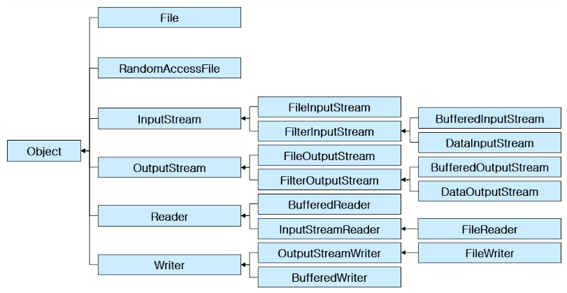

JAVA IO
==================

# 스트림이란?
* 데이터를 운반하는데 사용되는 연결통로
* 연속적인 데이터의 흐름
* 단방향성, FIFO

# 바이트 단위 입출력 스트림

* InputStream / OutputStream
* 바이트 단위로 데이터 전송
* **File**InputStream, **File**OutputStream
* **ByteArray**InputStream, **ByteArray**OutputStream

# 문자 단위 입출력 스트림

* Reader / Writer
* 문자 단위로 데이터 전송
* **File**Reader, **File**Writer
* **Buffered**Reader, **Buffered** Writer

# 자바 입출력 상속 관계도

# 바이트 단위 입출력 예제

<pre>
<code>
package exIO;

import java.io.*;

public class Ex1 {

	public static void main(String[] args) {
		// TODO Auto-generated method stub
		FileInputStream fis = null; 
        FileOutputStream fos = null;        
        try {
            fis = new FileInputStream("input.txt"); // 파일로부터 읽어오기 위한 객체
            fos = new FileOutputStream("output.txt"); // 파일에 쓸 수 있게 해주는 객체

            int readData = -1; // read() 메소드가 끝을 나타낼 때 -1을 return하므로 int형으로 선언
            while((readData = fis.read())!= -1){ // 1 byte씩 읽고
                fos.write(readData); // 1 byte씩 쓴다
            }           
        } catch (Exception e) {
            // TODO Auto-generated catch block
            e.printStackTrace();
        }finally{
            try {
                fos.close(); // OutputStream 닫기
            } catch (IOException e) {
                // TODO Auto-generated catch block
                e.printStackTrace();
            }
            try {
                fis.close(); // InputStream 닫기
            } catch (IOException e) {
                // TODO Auto-generated catch block
                e.printStackTrace();
            }
        }
	}

}

</code>
</pre>

